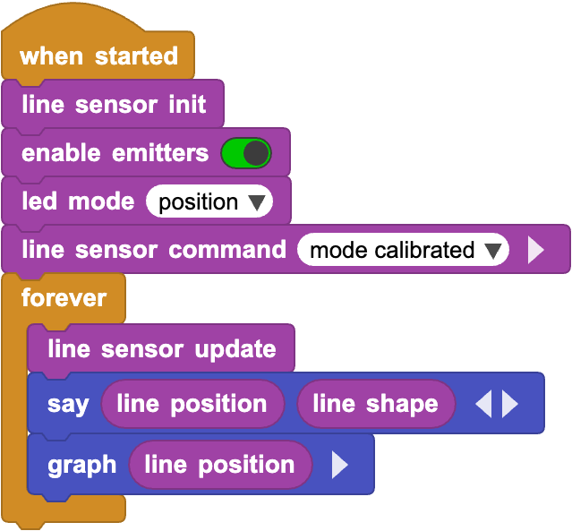

LMS Line Sensor
===============

MicroPython and Pybricks driver documentation for the LMS Line Sensor.

Installation
------------

On the newest LMS-ESP32 firmware, the line sensor driver is pre-installed.

If you are on older firmware, install it with vipe-ide:

- Open the package manager in vipe-ide.
- Choose custom package.
- Paste the Git repository link for this project.
- Install to the board.

For Pybricks, upload both ``line_sensor.py`` and ``uremote.py`` into your Pybricks project/environment.

PyPI/pip installation is not part of the normal deployment flow for this project.

Usage
-----

MicroPython with I2C
********************

Create a sensor instance by passing the I2C pin assignments and, if needed, a custom device address.

.. code-block:: python

   from time import sleep

   from line_sensor import LineSensorI2C

   sensor = LineSensorI2C(scl_pin=4, sda_pin=5, device_addr=51)
   sensor.ir_power(True)
   sensor.load_calibration()
   sensor.mode_calibrated()

   while True:
       print(sensor.position(), sensor.derivative())
       sleep(0.1)

Pybricks with uRemote
*********************

Create a sensor instance by passing the uRemote port.

.. code-block:: python

   from line_sensor import LineSensorUR
   from pybricks.parameters import Port

   sensor = LineSensorUR(Port.S1)
   sensor.ir_power(True)
   sensor.load_calibration()
   sensor.mode_calibrated()

   while True:
       print(sensor.position(), sensor.derivative())
       wait(100)

Useful constants exposed by the sensor classes include:

- ``MODE_RAW`` and ``MODE_CALIBRATED`` for acquisition mode selection.
- ``LEDS_OFF``, ``LEDS_VALUES``, ``LEDS_VALUES_INVERTED``, ``LEDS_POSITION``, and ``LEDS_MAX`` for LED display modes.
- ``POSITION``, ``MIN``, ``MAX``, ``DERIVATIVE``, and ``SHAPE`` for indexing values returned by ``data()``.
- ``SHAPE_STRAIGHT``, ``SHAPE_T``, ``SHAPE_L_LEFT``, ``SHAPE_L_RIGHT``, ``SHAPE_Y``, and ``SHAPE_NONE`` for line shape constants.

MicroBlocks
***********

Quick example program:

API Reference
-------------

.. automodule:: line_sensor
   :members:
   :undoc-members:
   :show-inheritance: