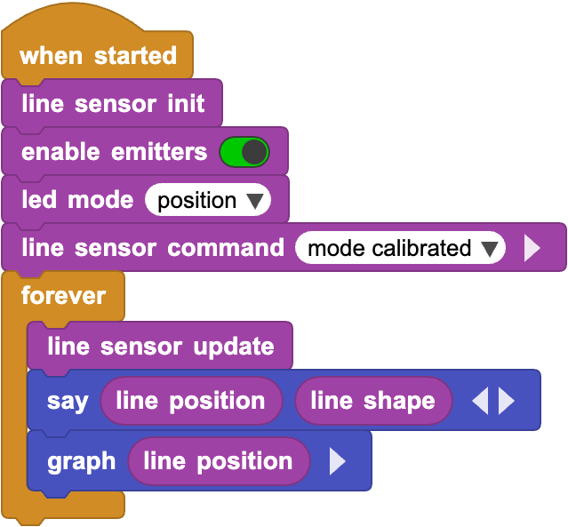

LMS Line Sensor
===============

Firmware for an eight-channel reflectance line sensor based on the CH32V203.
The sensor supports I2C, UART uRemote, and USB CDC uRemote. A browser dashboard
and a Windows/Linux Python client are included.

**Current firmware version: 5.5**

Features
--------

- Eight raw or calibrated reflectance values.
- Line position and position derivative.
- Shape recognition for straight, T, left, right, and Y intersections.
- EEPROM-backed calibration and configuration.
- Configurable IR https://github.com/AntonsMindstorms/lms-line-sensor/tree/main/docsemitter.
- Eight sensor NeoPixels plus one indicator NeoPixel.
- Automatic LED modes for values, inverted values, and line position.
- Unique 12-byte CH32V203 device ID.
- I2C slave interface at address ``0x33``.
- Named uRemote API on UART and native USB CDC.
- Browser dashboard for configuration, calibration, visualization, and diagnostics.
- Desktop Python uRemote library for Windows and Linux.

Interfaces
----------

.. list-table::
   :header-rows: 1

   * - Interface
     - Settings
     - Protocol
   * - I2C
     - Slave address ``0x33``
     - Numeric byte commands and binary replies
   * - UART
     - 115200 baud
     - Framed uRemote
   * - USB CDC
     - VID ``0xCAFE``, PID ``0x4001``, product ``Line Sensor uRemote``
     - Framed uRemote

UART and USB expose the same named uRemote handlers. USB CDC carries protocol
frames only and does not emit unsolicited text logs. Use the web dashboard or
the diagnostic uRemote commands instead of a normal text terminal.

Only one application should open the USB serial port at a time. Disconnect the
web dashboard before using the Python client or another serial application.

Flashing firmware
-----------------

1. Connect the Line Sensor board to your PC using USB.
2. Press the **RESET** button twice in quick succession.
3. A mass-storage device named **CH32V UF2** should appear in the file manager.
4. Drag the line-sensor UF2 firmware file onto the **CH32V UF2** drive.
5. Wait until the firmware is written. The mass-storage device disappears
   automatically.
6. If the NeoPixels do not scan, disconnect and reconnect USB power.

Startup indication
------------------

The startup NeoPixel scan reports the stored calibration/emitter configuration.

.. list-table::
   :header-rows: 1

   * - Load calibration
     - Emitter
     - Scan color
   * - Off
     - Off
     - Blue
   * - Off
     - On
     - Yellow
   * - On
     - Off
     - Red
   * - On
     - On
     - Green

USB web dashboard
-----------------

The ``web`` directory contains a dependency-free HTML, CSS, and JavaScript
dashboard. It implements uRemote directly through the browser Web Serial API.

The dashboard provides:

- USB connection and UID display.
- Raw/calibrated mode and emitter control.
- Numeric values and bar graphs for all eight sensors.
- Signed position and shape indication.
- Calibration start, load, save, minima, and maxima.
- EEPROM configuration editing.
- LED-mode and per-pixel NeoPixel tests.
- Live emitter, sensor-mode, and LED-mode status.
- On-demand command and runtime diagnostics.
- Light and dark themes.

Sensor data is requested every 250 ms. Runtime status is refreshed approximately
once per second while connected.

Start the dashboard
~~~~~~~~~~~~~~~~~~~

Web Serial requires a secure browser context. Localhost is accepted, so serve
the directory rather than opening ``index.html`` directly:

.. code-block:: console

   cd web
   python -m http.server 8000

Open ``http://localhost:8000`` in Chrome or Edge, select **Connect USB**, and
choose **Line Sensor uRemote**. Firefox and Safari do not currently provide the
required Web Serial API.

Dashboard diagnostics
~~~~~~~~~~~~~~~~~~~~~

Open **On-demand diagnostics / Command trace** and select **Refresh**. The panel
shows:

- Firmware uptime.
- I2C request-queue overflow count.
- Most recent UART uRemote command and parameters.
- Most recent I2C command and parameters.

USB dashboard requests are excluded from the trace, so normal page polling does
not overwrite the UART or I2C command being investigated. Connection and command
failures appear as dashboard notifications. Browser-side errors are available
in the Chrome/Edge Developer Tools Console.

Usage
-----

MicroPython with I2C
********************

Create a sensor instance by passing the I2C pin assignments and, if needed, a custom device address.

.. code-block:: python

   from time import sleep

   from line_sensor import LineSensorI2C

   sensor = LineSensorI2C(scl_pin=4, sda_pin=5, device_addr=51)
   sensor.ir_power(True)
   sensor.load_calibration()
   sensor.mode_calibrated()

   while True:
       print(sensor.position(), sensor.derivative())
       sleep(0.1)

Pybricks with uRemote
*********************

`uRemote <https://github.com/AntonsMindstorms/uRemote>`_ provides UART RPC between the Pybricks hub and LMS-ESP32.

Create a sensor instance by passing the uRemote port.

.. code-block:: python

   from line_sensor_pybricks import LineSensorUR
   from pybricks.parameters import Port

   sensor = LineSensorUR(Port.S1)
   sensor.ir_power(True)
   sensor.load_calibration()
   sensor.mode_calibrated()

   while True:
       print(sensor.position(), sensor.derivative())
       wait(100)

Useful constants exposed by the sensor classes include:

- ``MODE_RAW`` and ``MODE_CALIBRATED`` for acquisition mode selection.
- ``LEDS_OFF``, ``LEDS_VALUES``, ``LEDS_VALUES_INVERTED``, ``LEDS_POSITION``, and ``LEDS_MAX`` for LED display modes.
- ``POSITION``, ``MIN``, ``MAX``, ``DERIVATIVE``, and ``SHAPE`` for indexing values returned by ``data()``.
- ``SHAPE_STRAIGHT``, ``SHAPE_T``, ``SHAPE_L_LEFT``, ``SHAPE_L_RIGHT``, ``SHAPE_Y``, and ``SHAPE_NONE`` for line shape constants.

MicroBlocks
***********

Quick example program:

Python USB client
-----------------

The ``library`` directory contains the desktop ``uremote.py`` adaptation, port
selection, and a live-reading example for Windows and Linux.

.. code-block:: console

   cd library
   python -m pip install -r requirements.txt
   python read_line_sensor.py

The example lists detected ports and asks which one to open. A port can also be
provided directly:

.. code-block:: console

   python read_line_sensor.py --port COM5 --mode raw
   python read_line_sensor.py --port /dev/ttyACM0 --mode calibrated

API reference
-------------
Python module reference
***********************

.. automodule:: line_sensor
   :members:
   :undoc-members:
   :show-inheritance:

Line sensor hardware register and native commands
*************************************************

.. toctree::
   :maxdepth: 2
   :caption: Line sensor APIs

   API/lms-line-sensor-i2c-api
   API/lms-line-sensor-uremote-api

