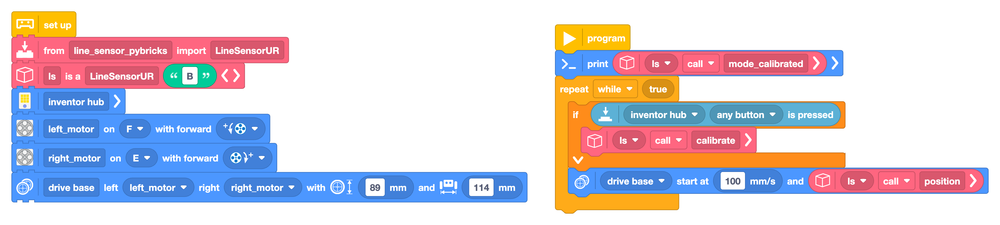

# SPIKE Prime Direct Line Sensor (LPUP + Pybricks)


Full walkthrough: [Line Sensor Direct Connection to SPIKE Prime: One Cable, No Bridge Board](https://www.antonsmindstorms.com/2026/07/09/direct-line-sensor-spike-prime-pybricks/)

Plug the 8-channel line sensor straight into a SPIKE Prime, Robot Inventor, or Technic hub with Pybricks. One LPUP cable, one driver file on the hub — no LMS-ESP32 bridge board in the chain.

The sensor computes position, derivative, and junction shape onboard. Your hub reads clean values over UART and steers with a short drive loop.

## Files

| File | Runs on | Purpose |
| ---- | ------- | ------- |
| [`line_sensor_pybricks_blocks.py`](line_sensor_pybricks_blocks.py) | SPIKE Prime | Minimal line follower — import in Pybricks Code or run as Python. |
| [`line_sensor_pybricks.py`](../../micropython/line_sensor_pybricks.py) | SPIKE Prime | Standalone driver bundle (`LineSensorUR` + uRemote client). Upload this first. |



## Hardware

- SPIKE Prime, Robot Inventor, or Technic hub with **Pybricks** firmware
- [8-channel line tracking sensor](https://www.antonsmindstorms.com/product/8-channel-line-sensor-for-lego-spike-and-mindstorms/)
- [LPUP cable](https://www.antonsmindstorms.com/product/lpup-cable/) — LEGO plug on the hub side, 2×3 header on the sensor
- Differential-drive robot (motors on ports **E** and **F** in the example)
- Black tape, printed track, or RoboCup tiles for testing

### Wiring

1. Plug the **LPUP end** into hub port **B** (any sensor port works).
2. Plug the **2×3 header** into the line sensor board. Align pin 1 with the marked side on the PCB.
3. Mount the sensor low and level, a few millimeters above the track.

## Setup

### 1. Upload the driver

Copy [`line_sensor_pybricks.py`](../../micropython/line_sensor_pybricks.py) into your Pybricks project. This single file includes `LineSensorUR` and the uRemote client — no separate uRemote upload needed.

### 2. Run the example

Open [`line_sensor_pybricks_blocks.py`](line_sensor_pybricks_blocks.py) in [Pybricks Code](https://code.pybricks.com/) or paste the Python below. Adjust motor ports and `DriveBase` dimensions to match your chassis.

```python
from pybricks.hubs import InventorHub
from pybricks.parameters import Button, Direction, Port
from pybricks.pupdevices import Motor
from pybricks.robotics import DriveBase

from line_sensor_pybricks import LineSensorUR

ls = LineSensorUR('B')
inventor_hub = InventorHub()
left_motor = Motor(Port.F, Direction.COUNTERCLOCKWISE)
right_motor = Motor(Port.E, Direction.CLOCKWISE)
drive_base = DriveBase(left_motor, right_motor, 89, 114)

print(ls.mode_calibrated())
while True:
    if any(inventor_hub.buttons.pressed()):
        ls.calibrate()
    drive_base.drive(100, ls.position())
```

## Usage

1. **Startup** — `mode_calibrated()` switches to calibrated readings. Saved calibration loads from the sensor EEPROM when available.
2. **Drive** — `drive_base.drive(100, ls.position())` is proportional steering: forward speed with turn rate from line offset.
3. **Calibrate** — press **any hub button** to run `calibrate()`. Sweep the sensor over black and white surfaces while the LEDs guide you; values save to EEPROM on the sensor.

Handy reads from the driver:

| Method | Returns |
| ------ | ------- |
| `ls.position()` | Line offset from center, roughly −127 to +127 |
| `ls.derivative()` | Rate of position change — ready for PD control |
| `ls.shape()` | Junction hint: `\|`, `<`, `>`, `Y`, `T`, or space |
| `ls.sensors()` | All eight calibrated channel values |

For PD tuning and competition tips, see [The Surprising PID Line Follower Guide](https://www.antonsmindstorms.com/2026/04/22/pid-line-follower-ev3-spike-prime-v2/).

## When to use LMS-ESP32 instead

Direct UART is the simple default for line following only. Use the [LMS-ESP32 + Pybricks path](../spike-robocup/) when you need multiple I2C sensors on one port, Wi-Fi, Bluetooth gamepads, or MicroBlocks workflows.
